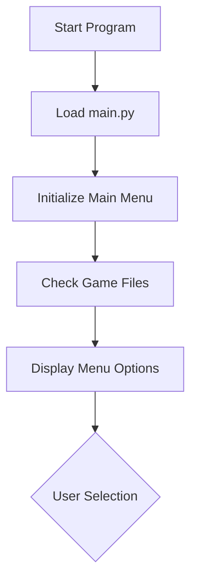
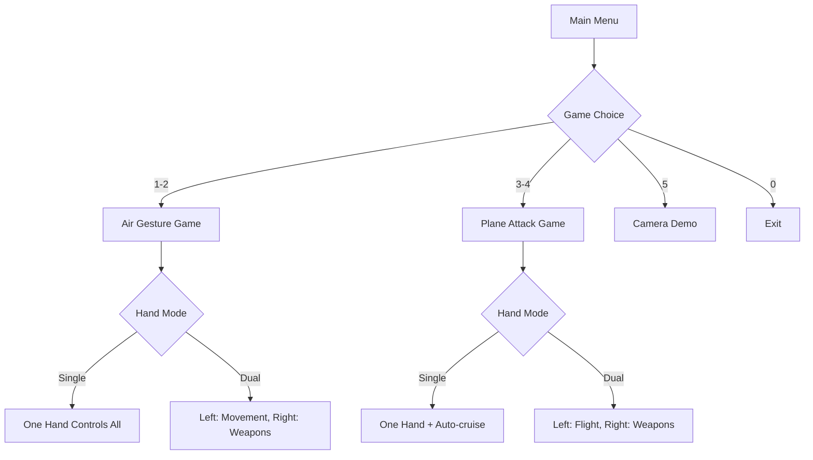
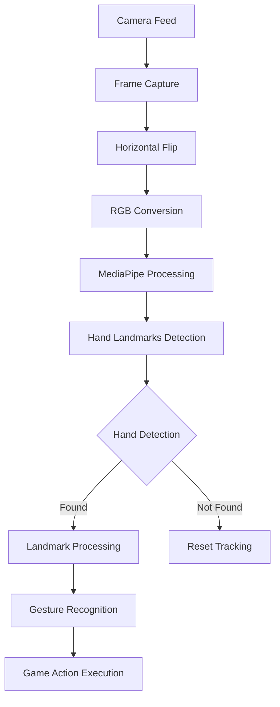
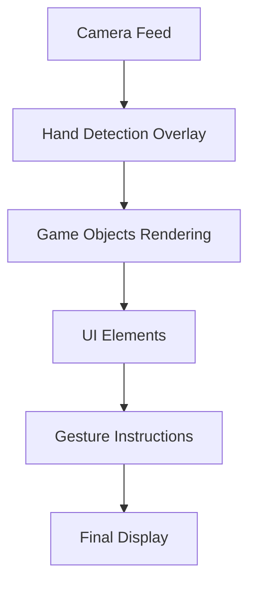

# 🎮 Air Gesture Games

A collection of computer vision-based games controlled entirely through hand gestures using MediaPipe and OpenCV.

## 🎯 Overview

This project features two main games that can be played in either **Single Hand** or **Dual Hand** modes:

1. **Air Gesture Game** - A space shooter with 20+ gesture-based attacks
2. **Plane Attack Game** - An aviation combat simulator with realistic physics
3. **Camera Tracking Demo** - A hand tracking demonstration

## 🏗️ System Architecture

### Core Components

```
📁 air_gesture/
├── main.py                    # 🎯 Main menu system & game launcher
├── air_gesture_game.py        # 🚀 Space shooter game
├── dual_hand_plane_game.py    # ✈️ Aviation combat game
└── README.md                  # 📖 This documentation
```

### Technology Stack

- **Computer Vision**: OpenCV (`cv2`)
- **Hand Tracking**: MediaPipe (`mediapipe`)
- **Math Operations**: NumPy (`numpy`)
- **Real-time Processing**: Python threading and timing

## 🔄 Workflow Overview

### 1. System Initialization


### 2. Game Selection Flow


## 🎮 Game Logic & Controls

### Air Gesture Game

#### **Single Hand Mode**
- **Movement**: Hand position controls player ship
- **Weapons**: Same hand performs gesture attacks
- **Gestures**: 20+ different attack types

#### **Dual Hand Mode**
- **Left Hand**: Controls player movement only
- **Right Hand**: All weapon gestures and attacks

#### **Gesture Recognition System**
```python
def detect_gestures(self, landmarks):
    # Finger tracking using MediaPipe landmarks
    # Distance calculations for pinch detection
    # Finger counting for multi-shot attacks
    # Directional analysis for pointing gestures
```

**Key Gestures:**
- 👌 **Pinch** → Standard shot
- 🤏 **Tight pinch** → Precision shot
- 👍 **Thumbs up** → Shield activation
- ✌️ **Peace sign** → Special ability
- 👊 **Fist** → Power punch
- 🖐️ **Open palm** → Mega shield
- ☝️ **Point up/down/left/right** → Directional attacks

### Plane Attack Game

#### **Single Hand Mode**
- **Movement**: Hand controls plane position and banking
- **Weapons**: Same hand performs weapon gestures
- **Auto-cruise**: Automatic speed management

#### **Dual Hand Mode**
- **Left Hand**: Flight control, speed, banking
- **Right Hand**: Weapon systems and attacks

#### **Flight Physics**
```python
def update_plane_from_left_hand(self, landmarks, gesture):
    # Smooth movement interpolation
    # Banking angle calculation from hand tilt
    # Speed control based on finger gestures
    # Boundary checking for flight area
```

**Weapon System:**
- 🔫 **Pinch** → Machine gun bullets
- ☝️ **Point** → Homing missiles
- 🖐️ **Open palm** → Bomb drops
- ✌️ **Peace sign** → Special barrel roll attack

## 🧠 Computer Vision Pipeline

### Hand Detection Flow


### Landmark Processing
```python
# Key landmarks used for tracking
landmarks[0]  # Wrist (center point)
landmarks[4]  # Thumb tip
landmarks[8]  # Index finger tip
landmarks[12] # Middle finger tip
landmarks[16] # Ring finger tip
landmarks[20] # Pinky tip
```

### Gesture Detection Algorithm
1. **Finger Extension Detection**: Compare finger tip to wrist distance
2. **Pinch Detection**: Calculate thumb-index distance
3. **Directional Analysis**: Determine pointing direction
4. **Gesture Classification**: Map hand pose to game action

## 🔧 Technical Implementation

### Camera Management
```python
def find_laptop_camera(self):
    # Automatic camera detection
    # HD capability testing
    # Optimization for hand tracking
    # Fallback camera selection
```

### Real-time Processing
- **Frame Rate**: 30 FPS optimized
- **Resolution**: 640x480 for performance
- **Buffer Management**: Single frame buffer for low latency
- **Smoothing**: Hand tracking with interpolation

### Game State Management
```python
class GameState:
    # Player position and status
    # Game objects (bullets, enemies, collectibles)
    # Hand tracking state
    # Gesture history for combos
    # Timing and scoring systems
```

## 🎯 Mode-Specific Logic

### Single Hand Mode
- **Simplified Controls**: One hand does everything
- **Auto-features**: Automatic speed/cruise control
- **Gesture Priority**: Movement vs. weapon gestures
- **UI Adaptation**: Single gesture display

### Dual Hand Mode
- **Specialized Controls**: Each hand has specific functions
- **Hand Separation**: Left = movement, Right = weapons
- **Enhanced Precision**: Dedicated weapon control
- **Advanced UI**: Dual hand status display

## 🔄 Main Menu System

### Menu Architecture
```python
def main():
    # Game file availability checking
    # User input validation
    # Error handling and recovery
    # Clean navigation between games
```

### Game Launcher Logic
1. **File Validation**: Check if game files exist
2. **Import Management**: Dynamic game loading
3. **Error Recovery**: Graceful failure handling
4. **State Management**: Clean game transitions

## 🎨 Visual Rendering

### Game Display Pipeline


### Rendering Components
- **Background**: Game-specific environments
- **Game Objects**: Player, enemies, projectiles
- **Effects**: Particles, explosions, trails
- **UI Overlay**: Score, lives, mode status
- **Camera Feed**: Small preview window

## 🚀 Performance Optimization

### Key Optimizations
1. **Camera Settings**: Optimized resolution and FPS
2. **Hand Tracking**: Efficient landmark processing
3. **Game Objects**: Object pooling for bullets/particles
4. **Memory Management**: Proper cleanup and garbage collection
5. **Frame Processing**: Minimal latency pipeline

### Hardware Requirements
- **Camera**: Built-in laptop camera or external webcam
- **CPU**: Modern processor for real-time processing
- **RAM**: 4GB+ recommended
- **Python**: 3.8+ with required packages

## 📦 Dependencies

```bash
pip install opencv-python
pip install mediapipe
pip install numpy
```

### Version Compatibility
- **NumPy**: < 2.0 (for TensorFlow compatibility)
- **OpenCV**: 4.5+
- **MediaPipe**: 0.9+

## 🎮 How to Play

### Starting the Games
```bash
python main.py
```

### Control Schemes

#### Air Gesture Game
- **Movement**: Move hand to control player ship
- **Shooting**: Pinch gesture for basic shots
- **Special Attacks**: Various hand gestures for different weapons
- **Shields**: Thumbs up or open palm for protection

#### Plane Attack Game
- **Flight**: Hand position controls plane movement and banking
- **Weapons**: Gestures for different weapon types
- **Speed Control**: Finger gestures for throttle control
- **Combat**: Tactical use of different weapon systems

## 🔧 Troubleshooting

### Common Issues
1. **Camera Not Found**: Check camera permissions and availability
2. **Hand Detection Issues**: Ensure good lighting and hand visibility
3. **Performance Problems**: Close other applications using camera
4. **Import Errors**: Verify all dependencies are installed

### Debug Mode
- Check camera feed window for hand detection
- Monitor gesture recognition in game UI
- Verify hand landmarks are being tracked

## 🎯 Future Enhancements

### Planned Features
- **Multiplayer Support**: Multiple players with different cameras
- **Gesture Customization**: User-defined gesture mappings
- **Advanced Physics**: More realistic game mechanics
- **Sound Effects**: Audio feedback for gestures and actions
- **Score Leaderboards**: Persistent high score tracking

## 📝 Development Notes

### Code Structure
- **Modular Design**: Each game is self-contained
- **Configurable Modes**: Easy switching between single/dual hand
- **Extensible Framework**: Easy to add new games
- **Clean Architecture**: Separation of concerns

### Testing
- **Unit Tests**: Individual component testing
- **Integration Tests**: Full game workflow testing
- **Performance Tests**: Frame rate and latency monitoring
- **User Testing**: Gesture recognition accuracy validation

---

## 🎉 Conclusion

The Air Gesture Games system demonstrates advanced computer vision techniques applied to interactive gaming. The dual-mode architecture provides flexibility for different user preferences, while the gesture recognition system offers intuitive and engaging gameplay experiences.

The modular design makes it easy to extend with new games and features, while the robust error handling ensures a smooth user experience across different hardware configurations.
